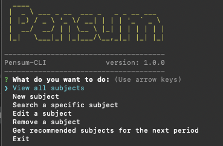
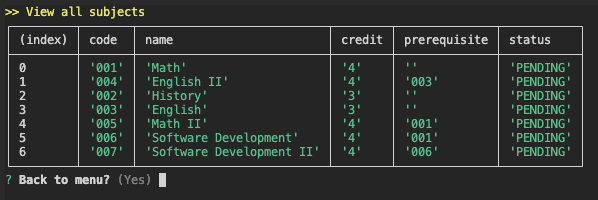
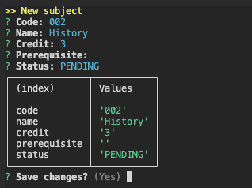
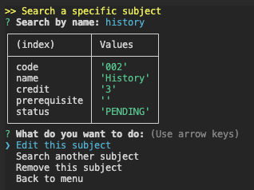
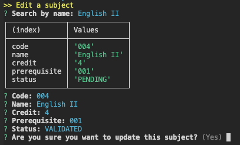
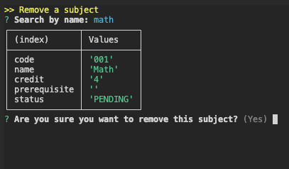
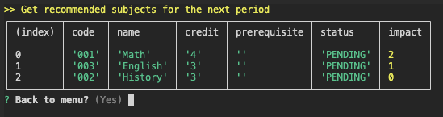

# Pensum

A curricular tool for students to keep track of their coursework

## Install

```npm
npm install -g pensum
```

# Usage

```bash
pensum
```


### View all subjects 
Shows all subjects in a table format like this:


### New subject


### Search an specific subject
Search a subject by its name ignore case sensitivity. Once it is found, you can:
- Edit the subject
- Remove it
- Search another one



### Edit a subject


### Remove a subject


### Get recommended subject for the next period
Pensum provides the recommended subjects for the following period to the students, this recommendation is based on the `impact` of each subject.

The `impact` of a course is measured in how many other courses it unlocks.



# What's next?
Lets be honest, the code base of this repository is a mess full of bad practices. It needs to be fixed... hopefully soon.

# Contributing
If someone wants to add or improve something, I invite you to collaborate directly in this repository: [pensum](https://github.com/rafavilomar/Pensum)

# License
Pensum is released under the [MIT License](https://opensource.org/licenses/MIT).